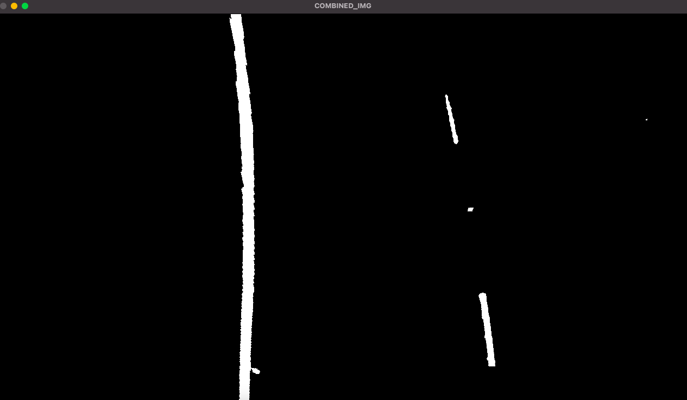
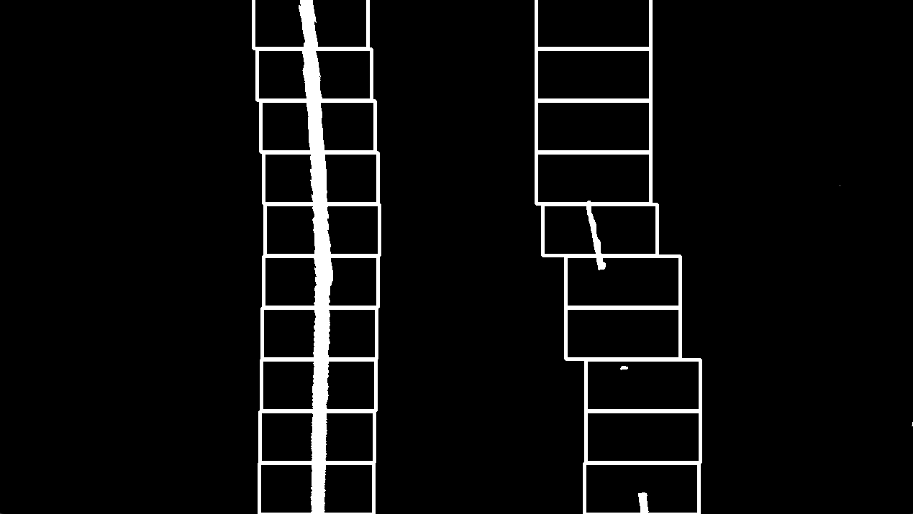

# Contents
- Background
- Logic
- Snapshots

# Environment
- OS : Windows11
- IDE : Visual Studio 2022 Community
- dependency : **[opencv](https://opencv.org/)**
- references
    - Repos and blog : 
        - https://github.com/snandasena/advanced-lane-finding
        - https://fwanggu-lee.tistory.com/41 (KOR)
    - Videos : 
        - Calculating gaussain elimination method (https://www.youtube.com/watch?v=2j5Ic2V7wq4)

# Background
- It doesn't include any machine learning technology.
- Purely using conventional Computer vision tech, by opencv library with pixels.
- It still has several works to do in terms of improving performance and accuracy. 

# Logic
**1. preprocessing img frame**

**2. capture necessary pixels**

**3. calculating coefficients of 2nd-order polynomial equation.**

**4. Drawing captured Lane data based on the approximate formula.**

 

# Snapshots(completed)

**Try #1**

**Try #2(improvement solving coefficients of 2nd-order polynomial equation.)**

# Todos
- [x] Make it run with video clip.
- [x] Organize readme file
- [ ] Improve performance about detecting the lines
